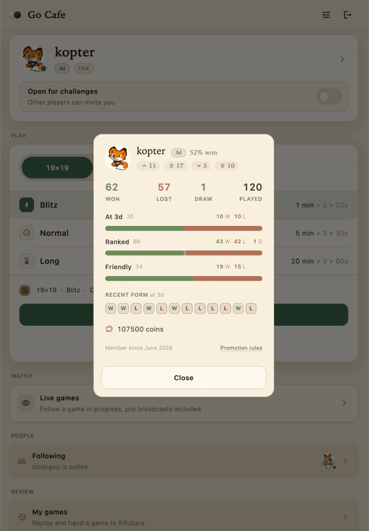
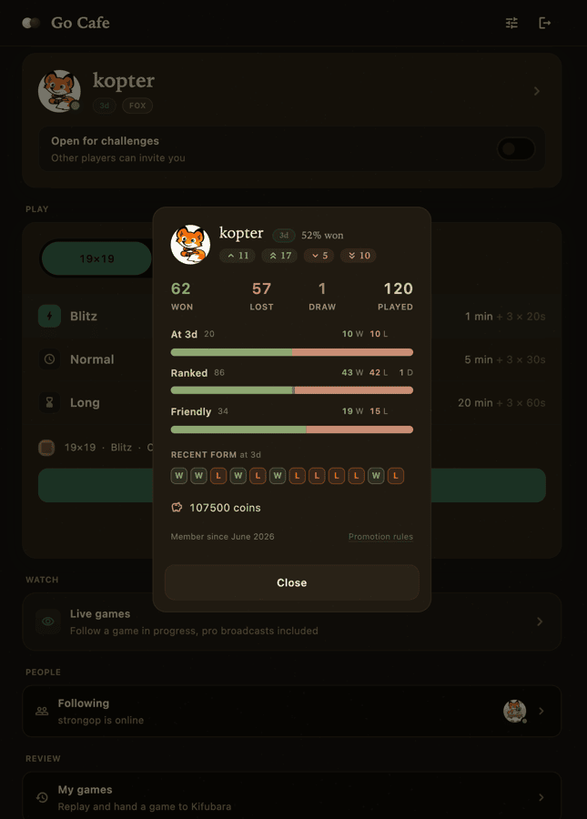
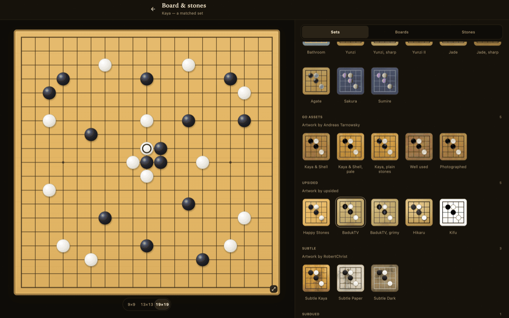
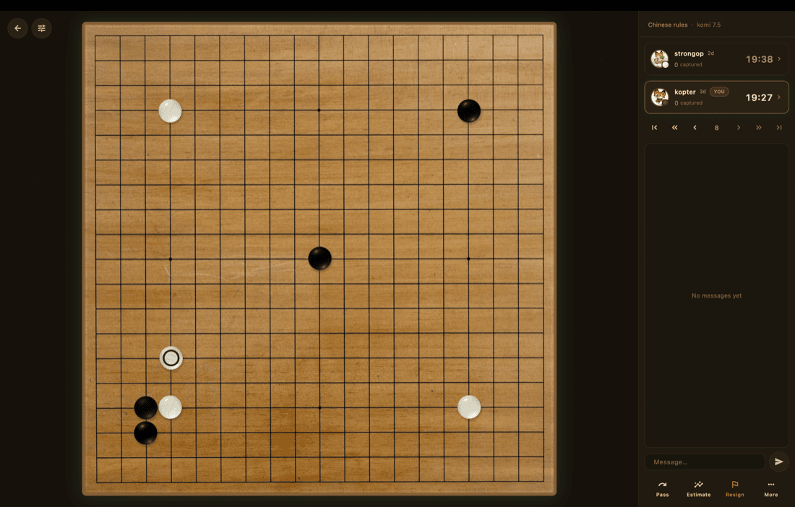
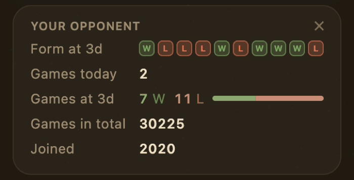
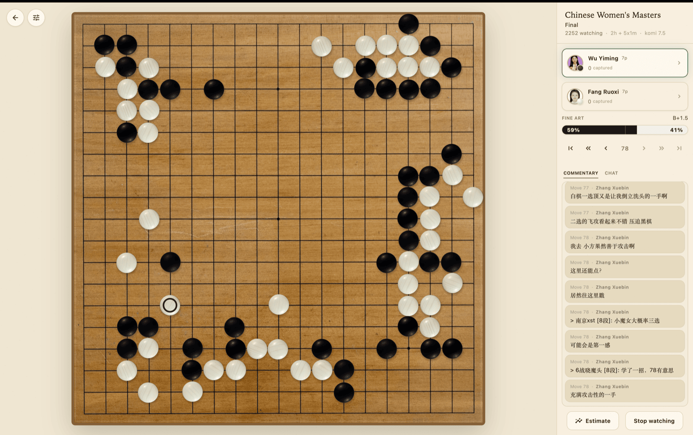

# Go Cafe

A native client for playing Go online on [Fox (foxwq)](https://www.foxwq.com/).
Board, clocks, lobby and history, without a browser.

<table>
<tr>
<td width="50%"></td>
<td width="50%"></td>
</tr>
</table>

## Install

**[Latest release](../../releases/latest)**

| Platform | File | Guide |
|---|---|---|
| **macOS** 10.15 or newer, Apple Silicon and Intel | `GoCafe-<version>.dmg` | [install](INSTALL-macos.md) |
| **Windows** 10 and 11, 64-bit | `GoCafe-<version>-windows-x64.zip` | [install](INSTALL-windows.md) |
| **Linux** x86_64, glibc 2.35 or newer | `GoCafe-<version>-x86_64.AppImage` | [install](INSTALL-linux.md) |
| **Android** 7.0 or newer | `GoCafe-<version>.apk` | [install](INSTALL-android.md) |

One line in Terminal installation on macOS:

```sh
curl -fsSL https://raw.githubusercontent.com/go-cafe-app/app/main/install.sh | bash
```

If you would rather not run a script, download the disk image and follow the
[macOS guide](INSTALL-macos.md).

Go Cafe is not in any app store and is not code-signed, so each system shows a
warning the first time you open it. Each guide says how to get past it. It is
one step.

## Updates

Go Cafe checks for a new version when it starts. When there is one, a card in
the corner shows what changed. On macOS and Linux, one click installs it and
the app restarts. On Android, the app downloads it and Android asks once before
installing. On Windows, the card links to the download page.

## A look around

**Pick your board and stones.** Boards and stone sets to mix and match.

<table>
<tr>
<td width="50%"></td>
<td width="50%"></td>
</tr>
</table>

**See who you're playing as the game starts.** Your opponent's form and record
are on screen from the first move.

<p align="center">
  
</p>

**Watch live games, including professional broadcasts,** with the commentary
and the engine's estimate as the game goes on. Player and tournament names are
shown in English.

<p align="center">
  
</p>

## Checking a download

Every file has a `.sha256` next to it:

```sh
sha256sum -c GoCafe-<version>.apk.sha256     # shasum -a 256 -c on macOS
```

An incomplete download is the usual reason an install fails. This catches it.

## Problems

Open an [issue](../../issues) and say what you did, what happened, and your
platform and version. Each guide says where the session log is. Attach it if
you can.

## Credits

Board and stone artwork is other people's work under MIT and CC BY-SA 4.0. Each
set is credited by name, author and licence on the app's **Settings → Credits**
screen.

Go Cafe is an unofficial client. It is not affiliated with or endorsed by Fox
Weiqi.
